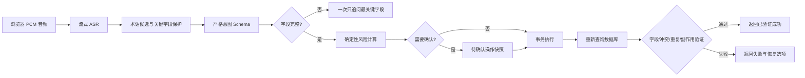

# CampusVoice 系统架构

## 架构边界

CampusVoice 首版采用模块化单体，不拆分微服务：

- `apps/web` 负责录音、交互状态、确认卡片以及任务、日历、通知和设置页面。
- `services/api` 负责业务规则、模型适配、事务执行、数据库验证和审计。
- SQLite 是首版唯一事实数据源；模型返回值不能作为操作成功的证据。
- FunASR、Whisper、Embedding 和 LLM 都通过适配器接入，业务代码不绑定供应商 SDK。

## 可靠操作流水线

## 数据与时间规则

- 数据库存储 UTC 时间，API 使用带时区的 ISO 8601；前端按用户时区显示，默认 `Asia/Shanghai`。
- 每次数据修改使用事务；确认内容在执行前冻结，执行后重新读取目标记录。
- 日志禁止包含完整音频、API 密钥或真实学生隐私数据。
- 测试替身只用于测试，生产和演示不会把固定结果伪装为真实模型输出。

## 可替换边界

| 能力   | 首版实现                             | 替换接口                                |
| ------ | ------------------------------------ | --------------------------------------- |
| 数据库 | SQLite + SQLAlchemy                  | SQLAlchemy repository/session           |
| ASR    | FunASR；Whisper 评测基线             | `AsrProvider`                           |
| 意图   | 规则安全基线 + OpenAI-compatible LLM | `IntentProvider`                        |
| 检索   | SQLite 文档块 + 本地评分/Embedding   | `ChunkRetriever`                        |
| LLM    | 结构化意图 + 证据约束通知问答        | `IntentLlmClient` / `KnowledgeAnswerer` |
