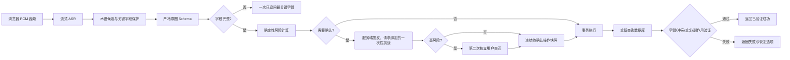

# CampusVoice 系统架构

## 架构边界

CampusVoice 首版采用模块化单体，不拆分微服务：

- `apps/web` 负责录音、交互状态、确认卡片以及任务、日历、通知和设置页面。
- `services/api` 负责业务规则、模型适配、事务执行、数据库验证和审计。
- SQLite 是首版唯一事实数据源；模型返回值不能作为操作成功的证据。
- FunASR、Whisper、Embedding 和 LLM 都通过适配器接入，业务代码不绑定供应商 SDK。

## 身份与信任边界

- `development/test` 可显式使用 demo authenticator；`production` 必须使用校园 OIDC/JWT 适配层。JWT 验证 issuer、audience、JWKS 非对称签名、到期时间和必需 claims，内部用户 ID 由受验证的 issuer/subject 服务端映射。
- REST 路由只从 `current_user` 依赖取得身份，repository 查询以内部用户 ID 约束；不存在可由客户端选择用户的 `X-User-ID`、路径或正文参数。跨用户记录统一表现为不存在。
- 浏览器 Bearer token 只驻留内存。ASR 先用认证 REST 请求换取绑定用户与 Origin 的短时一次性 ticket，再通过 WebSocket 子协议提交；数据库只保存 ticket 哈希。
- production 不允许 demo 回退、数据库自动建表或短确认密钥。配置与可选 AI 依赖不匹配时在应用启动阶段失败。

## 可靠操作流水线

## 数据与时间规则

- 数据库存储 UTC 时间，API 使用带时区的 ISO 8601；前端按用户时区显示，默认 `Asia/Shanghai`。
- 每次数据修改使用事务；确认内容在执行前冻结，执行后重新读取目标记录。
- Action 挑战绑定用户、action、payload 哈希、阶段与到期时间；普通写挑战绑定用户、方法、路径、规范化正文与阶段。挑战只保存哈希并原子消费。
- 日志禁止包含完整 token、正文、原始音频、API 密钥或真实学生隐私文本；用户只以进程盐化摘要出现。
- 测试替身只用于测试，生产和演示不会把固定结果伪装为真实模型输出。

## 可用性、资源与隐私边界

- `/health/live` 只检查进程；`/health/ready` 检查数据库连接、Alembic head 和启用组件配置，不在探针中下载或加载模型。
- `/api/metrics` 只暴露固定组件/操作和路由模板的进程内聚合，不包含用户、实体 ID、查询或供应商自由文本。ASR、意图、检索、LLM、动作执行和验证分别计时并计错。
- ASR 限制 Origin、单帧/控制帧大小、空闲时间、总会话、累计音频和单用户连接数；最外层清理保证模型、持久化会话和连接配额被释放。
- 原始音频不持久化且配置无法开启。转写、纠错、对话、终态操作与审计按独立窗口清理；导出使用字段白名单；业务数据删除需要服务端一次性挑战并在提交后重新验证。
- 外部意图 LLM 仅接收当前意图文本与必要上下文；外部通知问答仅接收检索到的编号证据。API key、内部凭据、音频与无关用户数据不进入模型请求。

## 可替换边界

| 能力   | 首版实现                             | 替换接口                                |
| ------ | ------------------------------------ | --------------------------------------- |
| 数据库 | SQLite + SQLAlchemy                  | SQLAlchemy repository/session           |
| ASR    | FunASR；Whisper 评测基线             | `AsrProvider`                           |
| 意图   | 规则安全基线 + OpenAI-compatible LLM | `IntentProvider`                        |
| 检索   | SQLite 文档块 + 本地评分/Embedding   | `ChunkRetriever`                        |
| LLM    | 结构化意图 + 证据约束通知问答        | `IntentLlmClient` / `KnowledgeAnswerer` |
| 身份   | demo（开发/测试）+ 校园 JWT/JWKS     | `Authenticator` / `AuthPrincipal`       |
