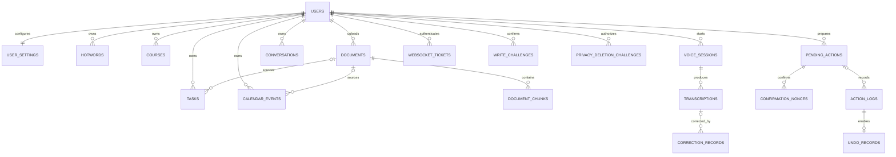

# CampusVoice data model

All application timestamps are accepted as timezone-aware values, normalized to UTC at the
SQLAlchemy boundary, stored as UTC, and returned with an explicit UTC offset. SQLite foreign-key
enforcement and WAL mode are enabled on every connection.

## v0.3 notice impact graph

`notice_series` owns an explicit ordered document chain. `documents` adds `series_id`, `supersedes_document_id`, `revision_number`, `effective_at`, `is_current`, and `ingest_source`. `notice_claims` stores comparable facts with exact chunk evidence. `notice_change_sets/items` preserve algorithm-versioned deterministic diffs. `impact_cases` forms the idempotent exact-lineage edge from a change to a task/event and records `recommended_action` plus `requires_manual_review`. `impact_migration_plans/items` freezes a generation of the bundle preview, before/after snapshots, optimistic versions, conflicts, execution keys, independent execute/undo receipts, item-level verification, and group undo state.

`tasks` and `calendar_events` now carry `source_document_id`, `source_chunk_id`, `source_claim_id`, and append-only `source_history`. Source IDs are validated as one current-user lineage before ordinary task/event writes.

Key constraints:

- unique series key per user and unique revision per series;
- unique claim per document/key/extractor version;
- unique change set per user/document pair/algorithm version;
- unique change item per set/key;
- unique impact per user/change/entity;
- one plan per user/change set/generation and one migration item per plan/entity;
- unique nullable execution and undo idempotency keys per user;
- positive plan generation/optimistic versions, bounded claim/change confidence, valid recommendation values, and mandatory manual flag for `manual_review`.

## ER relationship map



## Tables and key fields

| Table                                        | Purpose and principal fields                                                                                                                          | Important constraints                                                                       |
| -------------------------------------------- | ----------------------------------------------------------------------------------------------------------------------------------------------------- | ------------------------------------------------------------------------------------------- |
| `users`                                      | Stable internal account boundary: `id`, `display_name`, `is_active`, timestamps.                                                                      | Demo seeds `user_demo`; JWT/OIDC maps verified issuer/subject server-side.                  |
| `oidc_login_transactions`                    | Short-lived state hash, nonce and PKCE verifier for exactly one callback.                                                                             | Opaque flow cookie; consumed atomically; no access token or client secret.                  |
| `oidc_sessions`                              | Hash of opaque browser session, server-derived principal, roles and bounded expiry.                                                                   | Raw cookie is never stored; revoked/expired rows authenticate as `401`.                     |
| `user_settings`                              | Profile and runtime preferences: major, grade, course/teacher JSON, default reminder, timezone and ASR configuration.                                 | One row per user; reminder is non-negative.                                                 |
| `hotwords`                                   | Course, teacher, AI-term, document and custom recognition terms with source, weight and active flag.                                                  | Unique per `(user_id, term, category)`; non-blank term.                                     |
| `courses`                                    | User course code, name, teacher and academic term.                                                                                                    | Unique `(user_id, code, term)` and non-blank name.                                          |
| `tasks`                                      | Title, description, course reference/snapshot, due/reminder times, priority, status, source document/type and optimistic `version`.                   | Non-blank title and positive version; indexed by user/status/due time.                      |
| `calendar_events`                            | Title, course, UTC start/end, location, reminder, provenance and optimistic `version`.                                                                | `end_at > start_at`, non-negative reminder, indexed overlap fields.                         |
| `documents`                                  | Notice metadata plus immutable hash, storage reference, processing status and error.                                                                  | Unique hash per user; no fabricated page metadata.                                          |
| `document_chunks`                            | Ordered source text, real page number when available, embedding and parser metadata.                                                                  | Unique `(document_id, ordinal)`; page is null or positive.                                  |
| `notice_series`                              | User-scoped canonical identity and metadata for one explicitly linked notice version chain.                                                           | Unique `(user_id, canonical_key)`; predecessor ambiguity is resolved before insertion.      |
| `notice_claims`                              | Structured value, normalized value, audience rule, confidence, extractor version and exact document/chunk evidence interval.                          | Unique document/key/extractor version; confidence and evidence ranges are checked.          |
| `notice_change_sets` / `notice_change_items` | Immutable algorithm-versioned v1/v2 semantic diff with before/after claims, severity, confidence and review state.                                    | Unique pair/algorithm and set/key; low-confidence items cannot propagate before review.     |
| `impact_cases`                               | Exact old-claim dependency edge, current snapshot, proposed patch, recommendation, manual-review flag and lifecycle status.                           | Unique user/change/entity; recommendation enum and manual-review consistency checks.        |
| `impact_migration_plans`                     | Generation, ready/applied/verified/undo states, conflicts, independent receipts and execution/undo idempotency keys.                                  | Unique user/change/generation and user operation keys; positive generation/version.         |
| `impact_migration_items`                     | Per-entity expected version, before/proposed/after snapshots, supporting claim IDs and independent execute/undo database verification.                | Unique plan/entity; plan ownership and optimistic version are revalidated before mutation.  |
| `voice_sessions`                             | ASR provider/model, lifecycle status, duration and bounded error metadata; `audio_reference` remains null in v0.2.                                    | Raw audio persistence is rejected by configuration and never written.                       |
| `transcriptions`                             | Ordered interim/final text, confidence and latency for a voice session.                                                                               | Unique session sequence; confidence range `[0,1]`.                                          |
| `correction_records`                         | Original/corrected text, changed spans, candidates, reason, confidence and user decision.                                                             | Confidence range `[0,1]`.                                                                   |
| `conversations`                              | Short-lived clarification context and active intent.                                                                                                  | User-scoped; not a general chat history store.                                              |
| `pending_actions`                            | Immutable confirmed payload, deterministic risk factors, missing/ambiguous/blocking data, confirmation state, TTL, retry counter and verified result. | Unique user idempotency key; at most two confirmations and bounded retries.                 |
| `action_logs`                                | Source/corrected text, intent/slots, risk, user confirmation, before/after snapshots, verification result and failure reason.                         | Append-oriented user timeline; no API keys or full audio.                                   |
| `undo_records`                               | One inverse operation snapshot per successful action log, with expiry and state.                                                                      | One-to-one action log relation; inverse changes are also verified.                          |
| `confirmation_nonces`                        | Hash-only record of a consumed Action challenge nonce.                                                                                                | Unique action/stage; bound to user, payload hash and expiry; raw challenge is never stored. |
| `websocket_tickets`                          | Hash-only, short-lived ASR handshake credential with user, Origin and consumption time.                                                               | Single-use; raw ticket is returned once and never persisted.                                |
| `write_challenges`                           | Hash-only direct-write credential with flow, user, method, path, canonical body hash, stage and expiry.                                               | Unique flow/stage; final stage is atomically consumed before mutation.                      |
| `privacy_deletion_challenges`                | Short-lived hashed nonce authorizing a current-user business-data clear.                                                                              | Bound to user and scope; opaque nonce is never stored and consumption is one-time.          |

## Reliable action state machine

```text
needs_input ------------------------------> cancelled / expired
awaiting_confirmation --confirm #1-------> ready (medium risk)
awaiting_confirmation --confirm #1-------> awaiting_second_confirmation (high risk)
awaiting_second_confirmation --confirm #2-> ready
ready --execute transaction---------------> executing
executing --post-commit re-query succeeds-> executed --verified inverse--> undone
executing --write/verification fails------> failed (bounded retry only)
```

Server-issued confirmation challenges bind the current user, action, payload fingerprint, stage,
nonce and expiry. Nonce hashes are unique per action/stage, the payload is snapshotted at final
confirmation, and execution rejects a changed payload. Duplicate events are blocked. Conflicting
events require an explicit override, are classified high risk, and therefore need two separate
confirmations.
