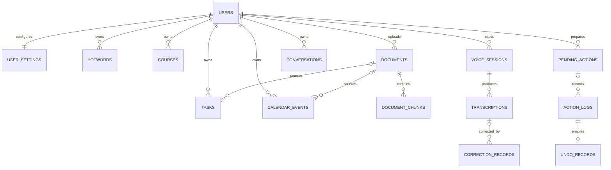

# CampusVoice data model

All application timestamps are accepted as timezone-aware values, normalized to UTC at the
SQLAlchemy boundary, stored as UTC, and returned with an explicit UTC offset. SQLite foreign-key
enforcement and WAL mode are enabled on every connection.

## ER relationship map



## Tables and key fields

| Table                | Purpose and principal fields                                                                                                                                  | Important constraints                                                       |
| -------------------- | ------------------------------------------------------------------------------------------------------------------------------------------------------------- | --------------------------------------------------------------------------- |
| `users`              | Stable account boundary: `id`, `display_name`, `is_active`, timestamps.                                                                                       | The MVP seeds `user_demo`; APIs never accept a client-supplied user ID.     |
| `user_settings`      | Profile and runtime preferences: major, grade, course/teacher JSON, default reminder, timezone and ASR configuration.                                         | One row per user; reminder is non-negative.                                 |
| `hotwords`           | Course, teacher, AI-term, document and custom recognition terms with source, weight and active flag.                                                          | Unique per `(user_id, term, category)`; non-blank term.                     |
| `courses`            | User course code, name, teacher and academic term.                                                                                                            | Unique `(user_id, code, term)` and non-blank name.                          |
| `tasks`              | Title, description, course reference/snapshot, due/reminder times, priority, status, source document/type and optimistic `version`.                           | Non-blank title and positive version; indexed by user/status/due time.      |
| `calendar_events`    | Title, course, UTC start/end, location, reminder, provenance and optimistic `version`.                                                                        | `end_at > start_at`, non-negative reminder, indexed overlap fields.         |
| `documents`          | Notice metadata plus immutable hash, storage reference, processing status and error.                                                                          | Unique hash per user; no fabricated page metadata.                          |
| `document_chunks`    | Ordered source text, real page number when available, embedding and parser metadata.                                                                          | Unique `(document_id, ordinal)`; page is null or positive.                  |
| `voice_sessions`     | ASR provider/model, lifecycle status, duration, optional controlled audio reference and error.                                                                | No raw audio bytes or secrets in logs.                                      |
| `transcriptions`     | Ordered interim/final text, confidence and latency for a voice session.                                                                                       | Unique session sequence; confidence range `[0,1]`.                          |
| `correction_records` | Original/corrected text, changed spans, candidates, reason, confidence and user decision.                                                                     | Confidence range `[0,1]`.                                                   |
| `conversations`      | Short-lived clarification context and active intent.                                                                                                          | User-scoped; not a general chat history store.                              |
| `pending_actions`    | Immutable confirmed payload, deterministic risk factors, missing/ambiguous/blocking data, confirmation tokens, state, TTL, retry counter and verified result. | Unique user idempotency key; at most two confirmations and bounded retries. |
| `action_logs`        | Source/corrected text, intent/slots, risk, user confirmation, before/after snapshots, verification result and failure reason.                                 | Append-oriented user timeline; no API keys or full audio.                   |
| `undo_records`       | One inverse operation snapshot per successful action log, with expiry and state.                                                                              | One-to-one action log relation; inverse changes are also verified.          |

## Reliable action state machine

```text
needs_input ------------------------------> cancelled / expired
awaiting_confirmation --confirm #1-------> ready (medium risk)
awaiting_confirmation --confirm #1-------> awaiting_second_confirmation (high risk)
awaiting_second_confirmation --confirm #2-> ready
ready --execute transaction---------------> executing
executing --post-commit re-query succeeds-> executed --verified inverse--> undone
executing --write/verification fails------> failed (bounded retry only)
```

Confirmation tokens are de-duplicated, the payload is snapshotted at final confirmation, and
execution rejects a changed payload. Duplicate events are blocked. Conflicting events require an
explicit override, are classified high risk, and therefore need two confirmations.
